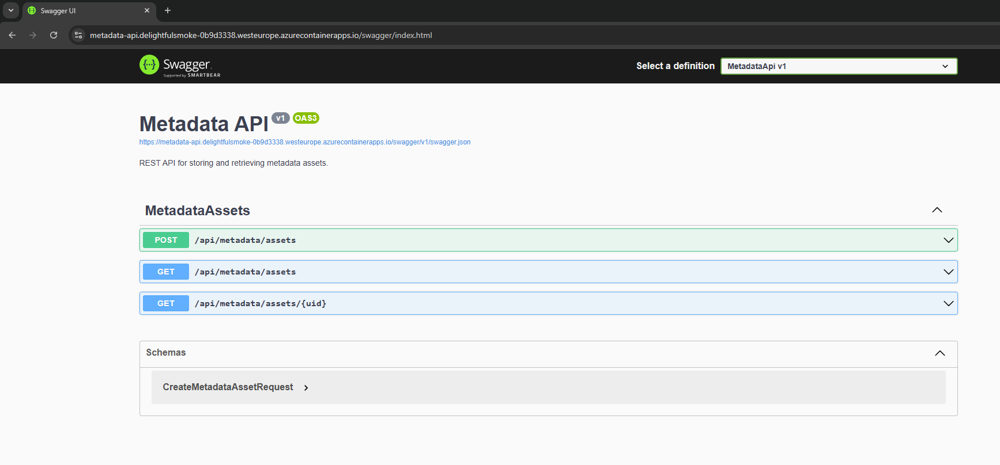
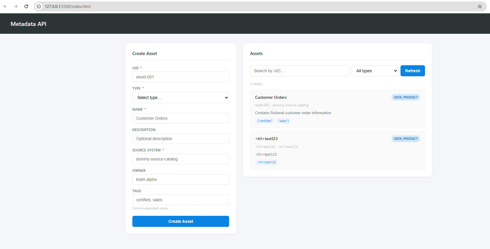

# Metadata API — C#/.NET

A simple REST API built with ASP.NET Core 8 for storing and retrieving metadata assets.
The API supports creating assets with validation, querying by UID, and filtering by type —
backed by in-memory storage and documented via Swagger UI.

---
## Project Structure

```
MetadataApi/
  Controllers/
    MetadataAssetsController.cs   ← HTTP routing only, no business logic
  Dtos/
    CreateMetadataAssetRequest.cs ← Input contract with validation
    MetadataAssetResponse.cs      ← Output contract
  Models/
    MetadataAsset.cs              ← Internal domain model
  Services/
    IMetadataAssetService.cs      ← Interface for testability
    MetadataAssetService.cs       ← In-memory business logic
  Frontend/
    index.html                    ← Simple frontend
  Program.cs                      ← DI registration, middleware pipeline
  Dockerfile                      ← Multi-stage build
```

## Live Demo

### URL Metadata API in Azure Cloud.
| Swagger UI | https://metadata-api.delightfulsmoke-0b9d3338.westeurope.azurecontainerapps.io/swagger |


### Run Frontend Locally

A simple HTML frontend is available in the `frontend/` folder.
Open `index.html` using [Live Server](https://marketplace.visualstudio.com/items?itemName=ritwickdey.LiveServer) (VS Code extension) to serve it on `http://127.0.0.1:5500`.


> **Note:** To connect the local frontend to the live API, CORS must allow `http://127.0.0.1:5500`.
> This can be configured in the Azure Portal under **Container App → Ingress → CORS**.

## How to Run
**Requirements:** .NET 8 SDK

### Locally

**Step 1:** Clone the project into a local device for use and testing

**Step 2:** Run following command in terminal
```bash
cd MetadataApi
dotnet restore
dotnet run
```

Open `https://localhost:{port}/swagger` to explore the API with Swagger UI.

### Docker

```bash
docker build -t metadata-api .
docker run -p 5000:8080 metadata-api
```

Open `http://localhost:5000/swagger`.

---

## API Endpoints

### `POST /api/metadata/assets`
Create a new metadata asset.

```json
{
  "uid": "asset-001",
  "type": "DATA_PRODUCT",
  "name": "Customer Orders",
  "description": "Contains fictional customer order information",
  "owner": "team-alpha",
  "sourceSystem": "dummy-source-catalog",
  "tags": ["certified", "sales"]
}
```

| Field | Required | Notes |
|---|---|---|
| `uid` | ✅ | Must be unique — duplicate returns `409 Conflict` |
| `type` | ✅ | Free-text string |
| `name` | ✅ | |
| `sourceSystem` | ✅ | |
| `description` | ❌ | |
| `owner` | ❌ | |
| `tags` | ❌ | Defaults to `[]` if not provided |

### `GET /api/metadata/assets/{uid}`
Returns the asset or `404 Not Found`.

### `GET /api/metadata/assets?type=DATA_PRODUCT`
Returns all assets. Optional `type` filter is case-insensitive.

---


**Design decisions:**
- Controller handles HTTP concerns only — all logic lives in the Service
- DTOs are decoupled from the domain Model — API contract can evolve independently
- `IMetadataAssetService` interface allows unit testing and future storage replacement
- `Dictionary<string, MetadataAsset>` for O(1) uid lookup
- `Tags` defaults to `[]` at the Model level — never null anywhere in the codebase

---

## Estimated Time Spent: 8 hours


---

## Assumptions

1. **In-memory storage is intentional** — data does not persist between restarts. A production system would use a database (e.g. PostgreSQL, CosmosDB).

2. **`uid` is immutable** — no PATCH/PUT endpoint was implemented as it was not in the spec. Once created, an asset cannot be updated.

3. **`type` is free-text** — the spec shows example values but does not restrict to an enum. Kept as a string to remain flexible.

4. **Case-insensitive type filter** — `?type=data_product` and `?type=DATA_PRODUCT` return the same results. More user-friendly.

5. **`tags` defaults to `[]`** — enforced at the Model level, not just in validation. No null checks needed anywhere downstream.

6. **Swagger enabled in all environments for this demo** — in a real production system, Swagger would be restricted to Development only.

7. **CORS open policy** — `AllowAnyOrigin` is set for demo purposes. In production, this would be restricted to known frontend origins.

---

## Questions I Would Ask in a Real Project

**Business:**
- Is `uid` generated by the source system or should the API generate it? What format is expected (UUID, slug, custom)?
- What are the valid values for `type`? Should it be enforced as an enum?
- Is `owner` a free-text string or a reference to a user/team in another system?

**Technical:**
- What is the expected data volume? At what scale does in-memory storage need to be replaced with a database?
- Should the API support updates (PUT/PATCH) and deletes? What are the rules around soft-delete vs hard-delete?
- Is there an authentication/authorization requirement? Should certain teams only access their own assets?

